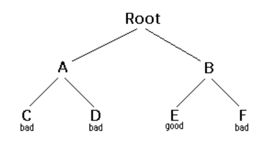
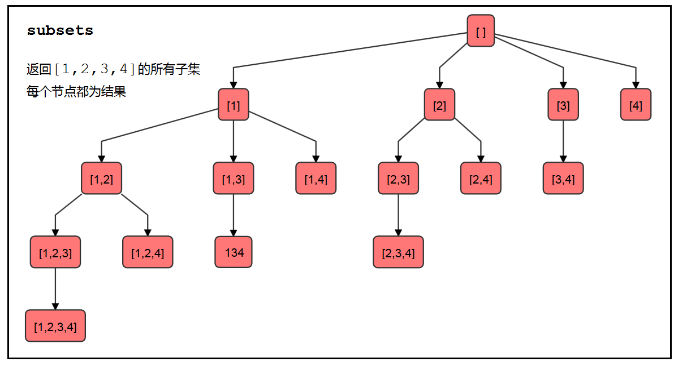
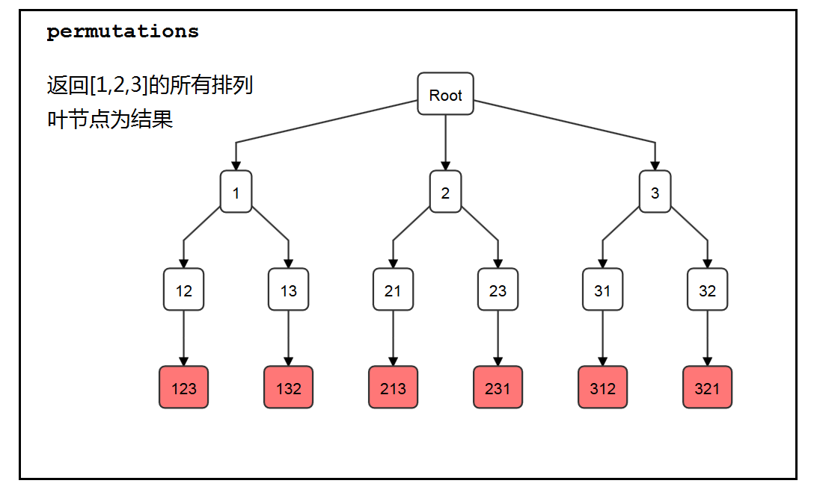
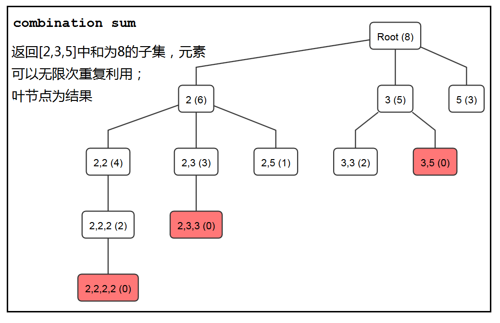
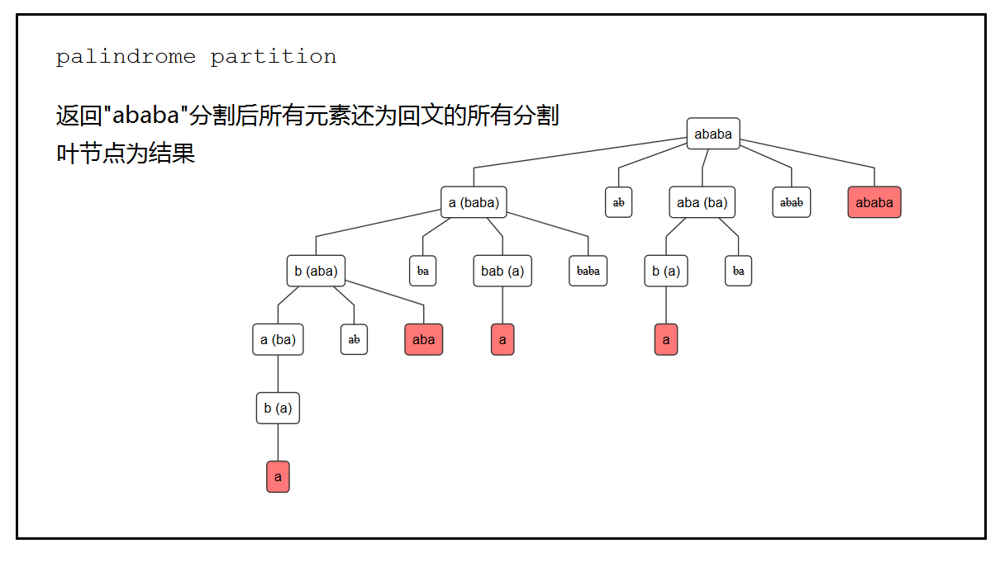
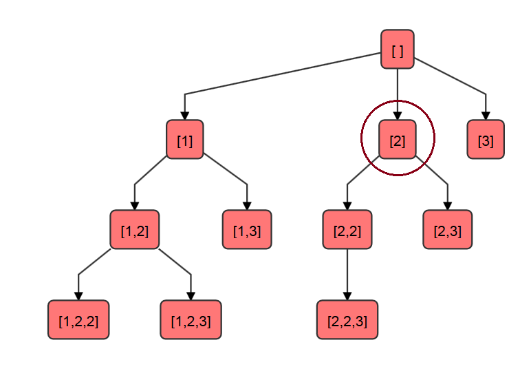
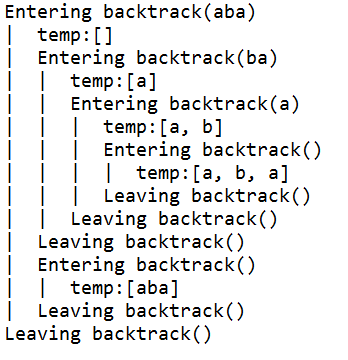
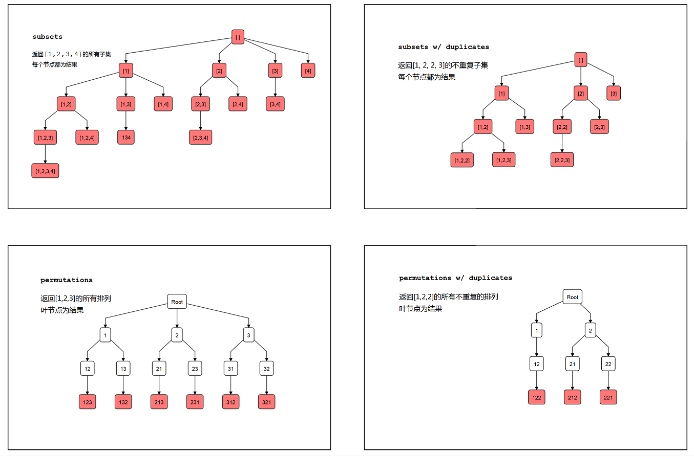
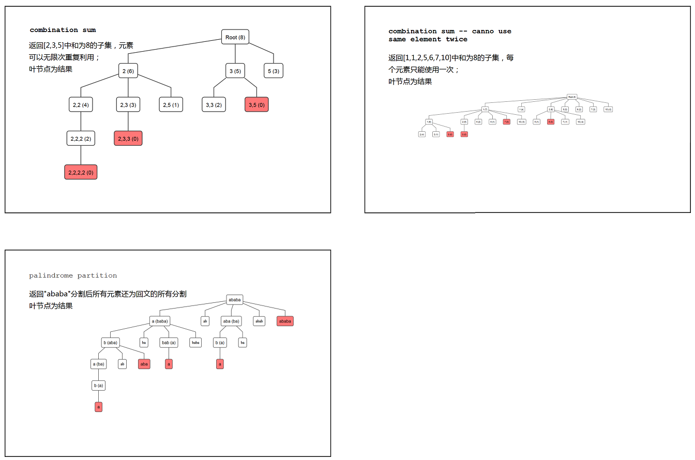

## <font size=4> **`0x000`** </font> <font size=4> **BACKTRACKING** </font>

backtracking（回溯法）是一类递归算法，通常用于解决某类问题：要求找出答案空间中**符合某种特定要求**的答案，比如[eight queens puzzle](https://en.wikipedia.org/wiki/Eight_queens_puzzle)（将国际象棋的八个皇后排布在8x8的棋盘中，使她们不能互相威胁）。回溯法会增量性地找寻答案，每次只构建答案的一部分，在构建的过程中如果意识到答案不符合要求，会立刻将这一部分答案及它的所有子答案抛弃，以提高效率。

回溯法的核心模型是一个**决策树**，每个节点的子节点代表该节点的选项。从根节点出发，作出某种选择达到节点A，随后会面临节点A的选项，重复这个过程直到达到叶节点。如果途中发现某节点B的状态已经不符合要求，那么弃掉以B为根节点的子决策树。

到达叶节点时，判断其是否符合问题要求，然后根据情况作相应处理（如将符合要求的叶节点加入一个list）。叶节点没有子节点，因此**回溯到上一个访问过的节点**，以尝试其他选择。当我们最终回溯到根节点，且已经穷尽了根节点的所有选择时，算法结束。



在上图的决策树中，用good和bad分别代表符合和不符合要求的叶节点。回溯法的遍历过程是这样的：


1. 从Root开始，有A和B两个选项。选择A。
2. 从A开始，有C和D两个选项。选择C。
3. C不符合要求，回溯到A。
4. A处的剩余选项为D。选择D。
5. D不符合要求，回溯到A。
6. A的选项已穷尽，回溯到Root。
7. Root处的剩余选项为B。选择B。
8. 从B开始，有E和F两个选项。选择E。
9. E符合要求，将其加入某个list，回溯到B。
10. B出的剩余选项为F。选择F。
11. F不符合要求。回溯到B。
12. B的选项已穷尽，回溯到Root。
13. Root的选项已穷尽。结束。

本文给出leetcode上数组排列组合问题的回溯法解答。这些问题大多为*“返回某数组/字符串的所有排列/组合”*类型，没有提出明确的要求来筛选叶节点。看起来，似乎简单地使用回溯法遍历决策树即可，但是在实现中会遇到一些棘手的小问题，比如**每一个选项如何定义，如何记录某一个节点上已经选择过的选项**等。学习回溯法时，可以先从这些问题开始熟悉回溯法的套路，熟练后再去解决更复杂的问题。


## <font size=4> **`0x001`** </font> <font size=4> **问题集** </font>

1. [subsets](https://leetcode.com/problems/subsets/description/): 给出一个不含重复元素的数组，返回它的所有子集；
2. [subsets w/ duplicates](https://leetcode.com/problems/subsets-ii/description/): 给出一个含有重复元素的数组，返回它的所有子集，不准重复；
3. [permutations](https://leetcode.com/problems/permutations/description/): 给出一个不含重复元素的数组，返回它的所有排列；
4. [permutations w/ duplicates](https://leetcode.com/problems/permutations-ii/description/):给出一个含有重复元素的数组，返回它的所有排列，不准重复；
5. [combination sum](https://leetcode.com/problems/combination-sum/description/): 给出一个整数数组及整数target，返回和为target的所有组合，每个元素可以使用无穷多次；
6. [combination sum -- cannot use same element twice](https://leetcode.com/problems/combination-sum-ii/description/): 给出一个整数数组及整数target，返回和为target的所有组合，每个元素只能使用一次；
7. [palindrome partition](https://leetcode.com/problems/palindrome-partitioning/description/): 给出一个String，返回它的所有分割，使分割后的每一个元素都是回文。


## <font size=4> **`0x002`** </font> <font size=4> **决策树** </font>

决策树的设计是回溯法的关键。对于排列组合问题，这一步的本质是将intuitional的想法映射到解题空间，变化为决策树每一个节点的选项。

注意，决策树并不是一个具体存在的数据结构。在回溯法中，决策树代表方法递归调用的方式和顺序，每一个节点的选项实际上编写在代码逻辑中，比如用一个for循环以某种逻辑遍历数组，并在每次的iteration中递归调用方法，这个过程相当于对某一个选项作出了选择。而退出到上一层方法则相当于回溯到决策树的上一个节点。

### <font size=3> **subset问题（问题1、2）** </font>
以subset问题为例，给出一个数组[1,2,3,4]，手动写出所有子集的过程大家都会，那么如何将它抽象成一个具体算法并映射到决策树？

可以这么想：[1,2,3,4]中有四个元素，其子集可以有0-4个元素。设计树的每一个节点为一个子集，根为空集。在根的基础上加一个元素，就成为了有1个元素的子集，那么根有4个选项。在第一层的节点基础上再增加一个元素，就成为了有2个元素的子集，以此类推，直至第四层。

那么，第一层一定有4个选项，分别为1，2，3，4。从1向下，即在1的基础上增加元素，则有12，13，14。从2向下，为了避免重复，只允许选择2之后的元素，则有23和24，以此类推。



如果以涂满红色表示节点为满足要求的结果，则整个树的所有节点都为结果，因为每个节点都代表数组的一个子集。

如果明白了subset问题的决策树设计，则subsets w/ duplicates问题与之大致类似，只是要避免重复的情况，即在subset问题的代码基础上加入一些条件判断。

### <font size=3> **permutation问题（问题3、4）** </font>
permutation问题实际上更为简单。对于数组[1,2,3],想象三个有顺序的盒子，每个盒子可以放一个不同的数字。顺着回溯法的**增量找寻答案**的思路，可以这么设计：树的第零层（根节点）三个盒子全为空，第一层填入盒子1，第二层在盒子1填入某数的基础上填入盒子2，第三层填入盒子3。



在这个决策树中，所有叶节点为想要找寻的结果。

与问题2相似，permutations w/ duplicates也需要在permutation问题的基础上加入判断条件，防止计入重复的排列。

### <font size=3> **combination sum问题（问题5、6）** </font>
combination问题与subset同为组合性质的问题，所以解法类似。在树的每一层增量选择一个元素构成答案的一部分。不同的是，由于有sum == target这个要求，在枚举过程中需要作出选择，抛弃不符合要求的选项。



在上图的决策树中，Root为空，括号中表示还需要求和的数，如第一层中的第一个节点2表示在组合中加入2，则剩余8-2=6。由于允许将同一个元素选择多次，2的选项中可以包含2自己。在3的选项中，为了防止重复，规定只能从3开始往后选择。可在回溯前对数组进行排序，则当发现括号中的数小于选项本身时（如5(3)），则该节点没有可行的选项，可以将该节点抛弃。

问题6在问题5的基础上加入条件判断。

### <font size=3> **palindrome partition（问题7）** </font>
与以上问题类似，用决策树对分割进行增量选择，在每一层对余下的字符串进行分割。当察觉到新的分割不是回文时可以立即舍弃。



看第一层： 对String "ababa"，先从头分割出一块，这一块的长度可以是1-5，于是我们有了图中第一层的5个节点，括号中表示余下的字符串。ab和abab都不是回文，因而可以立即舍去。ababa已经是一个完全分割了，因而可以加入答案集。再对其它节点括号中的元素进行分割，不再赘述。

本文附录中总结了问题1-7的决策树，以供参考。


## <font size=4> **`0x003`** </font> <font size=4> **实现** </font>

首先记住回溯法的一般普遍实现，对于不同的问题只要往这个框框上套即可。

```
boolean solve(Node n) {
    if n is a leaf node {
        if the leaf is a goal node, return true
        else return false
    } else {
        for each child c of n {
            if solve(c) succeeds, return true
        }
        return false
    }
}
```
以上代码描述了回溯法所使用的递归函数的大致样子，其实很简单。记住这个大致的样子是为了更熟练地写回溯法的代码。上图中的返回类型是boolean，表示以n为根节点的子树中是否存在答案；另外，默认只有叶节点可能成为答案。这些细节不一定是固定的，在不同问题中都可以灵活修改。

### <font size=3> **题目1：subsets** </font>
```
public List<List<Integer>> subsets(int[] nums){
        List<List<Integer>> result = new LinkedList<List<Integer>>();
        subsets(nums, 0, new ArrayList<Integer>(), result);
        return result;
    }
    
    private void subsets(int[] nums, int start, List<Integer> temp, List<List<Integer>> result){
        result.add(new ArrayList<Integer>(temp));
        for(int i = start; i < nums.length; i++){
            temp.add(nums[i]);
            subsets(nums, i + 1, temp, result);
            temp.remove(temp.size() - 1);
        }
    }
```
1. 进入下面这个private的subsets方法相当于进入了一个节点。此时（在第8行）temp中的值代表该节点对应的子集。（对应决策树图）
2. 由于每个节点都是答案，每次进入节点时先将temp加入result（第8行）。
3. 每个节点的选项为在该节点代表的子集基础上要增量增加的元素。前文中已经叙述到，为了避免子集重复，假设节点代表的子集为[1]，则子节点只能增加1**之后的元素**。此处的start变量是用来标记可选元素的左边界。
4. 回溯时，只需将子节点增量增加的元素去掉即可。

### <font size=3> **题目2：有重复元素的数组的subsets** </font>
```
public List<List<Integer>> subsetsWithDup(int[] nums){
        List<List<Integer>> result = new LinkedList<List<Integer>>();
        Arrays.sort(nums);
        subsetsWithDup(nums, 0, new ArrayList<Integer>(), result);
        return result;
    }
    
    private void subsetsWithDup(int[] nums, int start, List<Integer> temp, List<List<Integer>> result){
        result.add(new ArrayList<Integer>(temp));
        for(int i = start; i < nums.length; i++){
            if(i != start && nums[i] == nums[i-1]) continue;
            temp.add(nums[i]);
            subsetsWithDup(nums, i + 1, temp, result);
            temp.remove(temp.size() - 1);
        }
    }
```
1. 为了不引入重复子集，在回溯前先给数组排序，这样相同的元素会被排在一起，增量增加元素时跳过相同的元素即可。
2. 如上题，start表示某节点下选项可以增加的元素的左边界。比如数组[1,2,2,3]，下图圈出的节点选择的是index=1的2，则其子节点的start值为2，即选择范围为[1,2,2,3]。第一个加粗的2虽然跟前面的2重复，但由于下降了一层，这个2仍然需要考虑。于是有了第11行。



### <font size=3> **题目3：permutations** </font>
```
public List<List<Integer>> permute(int[] nums) {
        boolean[] used = new boolean[nums.length];
        List<List<Integer>> result = new LinkedList<List<Integer>>();
        permute(nums, used, new ArrayList<Integer>(), result);
        return result;
    }
    
    private void permute(int[] nums, boolean[] used, List<Integer> temp, List<List<Integer>> result){
        if(temp.size() == nums.length)
            result.add(new ArrayList<>(temp));
        else{
            for(int i = 0; i < nums.length; i++){
                if(used[i]) continue;
                used[i] = true;
                temp.add(nums[i]);
                permute(nums, used, temp, result);
                temp.remove(temp.size() - 1);
                used[i] = false;
            }
        }
    }
```    
1. 只有叶节点为答案，因此只有temp长度达到数组长度时将其加入。（9-10行）
2. 判断选项的合法性：用boolean数组used记录已经加入的元素。（13行）
3. 回溯方式：将加入选项时的行为（14-15行）做逆运算即可。（17-18行）

### <font size=3> **题目4：permutation w/ duplicates** </font>
```
public List<List<Integer>> permuteUnique(int[] nums) {
         Arrays.sort(nums);
         boolean[] used = new boolean[nums.length];
         List<List<Integer>> result = new LinkedList<List<Integer>>();
         permuteUnique(nums, used, new ArrayList<Integer>(), result);
         return result;
     }
     
     private void permuteUnique(int[] nums, boolean[] used, 
             List<Integer> temp, List<List<Integer>> result){
         if(temp.size() == nums.length)
             result.add(new ArrayList<>(temp));
         else{
             for(int i = 0; i < nums.length; i++){
                 if(used[i] || (i > 0 && nums[i] == nums[i-1] && !used[i-1]))
                     continue;
                 used[i] = true;
                 temp.add(nums[i]);
                 permuteUnique(nums, used, temp, result);
                 used[i] = false;
                 temp.remove(temp.size() - 1);
             }
         }
     }
```

这一题是所有问题中比较难的一题，难在如何排除重复排列。其实，与第2题一样，掌握一个秘籍即可：**重复的元素可以出现在决策树的不同层，但不能出现在同一层**。

由于已经出现在上面某层的元素会被used[]数组记录为true，因此只要查一下前面的同样元素是否出现在上面某层。如果出现过，说明当前元素可以出现在当前这层。（数组当然已经是排序的）

假设数组中有几个连着的2，现在进行到决策树的某一层，used[]数组表明前两个2已经出现过，按照代码第15行在当前层可以插入第三个2，而不能插入第四、第五个……这样做是合理的。

这个小trick有点难想，最好直接记住。

### <font size=3> **题目5:combination sum** </font>
```
public List<List<Integer>> combinationSum(int[] candidates, int target) {
        List<List<Integer>> result = new LinkedList<List<Integer>>();
        combinationSum(candidates, 0, target, result, new ArrayList<Integer>());
        return result;
    }
    
    private void combinationSum(int[] candidates, int start, int target, 
            List<List<Integer>> result, List<Integer> temp) {
        if(target == 0)
            result.add(new ArrayList<>(temp));
        else if(target < 0)
            return;
        else{
            for(int i = start; i < candidates.length; i++){
                temp.add(candidates[i]);
                combinationSum(candidates, i, target - candidates[i], result, temp);
                temp.remove(temp.size() - 1);
            }
        }
    }
```
1. 每次调用时更新target，target为负时直接返回。
2. 选项的排布方式与问题1类似，由于可以无限次重用某一元素，所以16行未把i加1。
3. 由上面几题看到，start的用法千变万化，死记是不科学的，要画出决策树充分理解题目的本质。（组合/排列?　可重用/不可重用?……）

### <font size=3> **题目6：combination sum -- cannot use same element** </font>
```
public List<List<Integer>> combinationSum2(int[] candidates, int target) {
        List<List<Integer>> result = new LinkedList<List<Integer>>();
        Arrays.sort(candidates);
        combinationSum2(candidates, 0, target, result, new ArrayList<Integer>());
        return result;
    }
    
    private void combinationSum2(int[] candidates, int start, int target, 
            List<List<Integer>> result, List<Integer> temp) {
        if(target == 0)
            result.add(new ArrayList<>(temp));
        else if(target < 0)
            return;
        else{
            for(int i = start; i < candidates.length; i++){
                if(i != start && candidates[i] == candidates[i-1])
                    continue;
                temp.add(candidates[i]);
                combinationSum2(candidates, i + 1, target - candidates[i], result, temp);
                temp.remove(temp.size() - 1);
            }
        }
    }
```
与题目2高度类似。

### <font size=3> **题目7：palindrome partition** </font>
```
public List<List<String>> partition(String s) {
        List<List<String>> result = new LinkedList<List<String>>();
        partition(s, new ArrayList<>(), result);
        return result;
    }
    
    private void partition(String s, List<String> temp, List<List<String>> result){
        if(s.length() == 0)
            result.add(new ArrayList<>(temp));
        else{
            for(int i = 1; i <= s.length(); i++){
                String partialString = s.substring(0, i);
                if(!isPalindrome(partialString)) continue;
                temp.add(partialString);
                partition(s.substring(i, s.length()), temp, result);
                temp.remove(temp.size() - 1);
            }
        }
    }
    
    private boolean isPalindrome(String s){
        int begin = 0, end = s.length() - 1;
        while(begin < end)
            if(s.charAt(begin++) != s.charAt(end--))
                return false;
        return true;
    }
```
思路与上面几题类似。要注意加粗的部分，由于substring的函数定义的关系，需要写成<=。

## <font size=4> **`0x004`** </font> <font size=4> **调试技巧** </font>
递归类的函数本身不是十分好理解，有一个小技巧，即把函数的调用用缩进的方式打印出来。

可以先准备一个Backtracking基类

```public class Backtracking {
      static String indent = "";
      
      static void enter() { //进入方法
          System.out.println(indent + "Entering backtrack()");
          indent = indent + "|  ";
      }
      
      static void leave(){ //退出方法
          indent = indent.substring(3);
          System.out.println(indent + "Leaving backtrack()");
      }
      
      static void print(String s){ //在方法内打印
          System.out.println(indent + s);
      }
  
  }
```
然后，让要调试的类继承Backtracking，调用对应的方法
```
public class Leetcode131 extends Backtracking{
    public List<List<String>> partition(String s) {
       ...//call backtrack()
    }
    
    private void backtrack(String s, List<String> temp, List<List<String>> result){
        enter(s);
        print("temp:"+temp);
        ...//method body (Recursive)
        leave();
    }
}
```
可以看到类似下图的结果：



## <font size=4> **`0x005`** </font> <font size=4> **小结** </font>
本文叙述了如何通过一些基本的排列组合问题练习回溯法。用回溯法解决一个问题时的大概思路是先画出某个输入例子的决策树，在树中，考虑如下几点：

- 每个节点有哪些选项，是否需要避免选项间的重复
- 如何从节点回溯到父节点
- 哪些节点属于答案要求的范围（叶节点/任意节点；满足哪些要求的叶节点等）

然后，根据回溯法的普遍实现进行代码实现。

## <font size=4> **`0x006`** </font> <font size=4> **附录：问题1-7的决策树** </font>
总结在此，读者可做对比。




##  <font size=4> **参考链接** </font>
- [A general approach to backtracking questions in Java](https://leetcode.com/problems/subsets/discuss/27281/A-general-approach-to-backtracking-questions-in-Java-(Subsets-Permutations-Combination-Sum-Palindrome-Partitioning))
  
- [backtracking by David Matuszek](http://www.cis.upenn.edu/~matuszek/cit594-2012/Pages/backtracking.html)
  
- [backtracking--wikipedia](https://en.wikipedia.org/wiki/Backtracking)
  
- [Backtracking, Memoization & Dynamic Programming!](https://loveforprogramming.quora.com/Backtracking-Memoization-Dynamic-Programming)