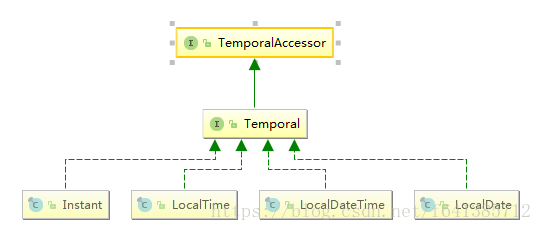
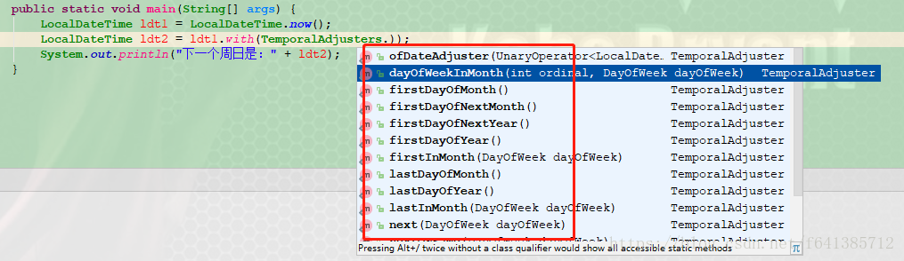

## <font size=4> **`0x000`** </font> <font size=4> **Java8之前的日期、时间现状** </font> 

Tiago Fernandez做了一个很有意思的投票,统计对Java API的不满意程度，最终Java Date/Time/Calendar API被评为最烂API第二名（第一为XML/DOM）。

`Java三次引入处理时间的API，JDK1.0中包含了一个Date类，但大多数方法在java1.1引入Calendear类之后被弃用了。
它的实例都是可变的，而且它的API很难使用，比如月份是从0开始这种反人类的设置。不止如此，还有如下的一些使用不方便的地方`

`其实JSR310的规范领导者Stephen Colebourne，同时也是Joda-Time的创建者，JSR310是在Joda-Time的基础上建立的，参考了绝大部分的API，但并不是说JSR310=JODA-Time，还是有好些区别的`

- Java的日期/时间类的定义并不一致，在java.util和java.sql的包中都有日期累，此外用于格式化和解析的类在java.text包中定义。
- Java 8之前老版的 java.util.Date 类以及其他用于建模日期时间的类有很多不一致及 设计上的缺陷，包括易变性以及糟糕的偏移值、默认值和命名
- java.util.Date同时包含日期和时间，而java.sql.Date仅包含日期，将其纳入java.sql并不合理。

```java
public static void main(String[] args) {
         java.util.Date date = new Date(System.currentTimeMillis());
         java.sql.Date sqlDate = new java.sql.Date(System.currentTimeMillis());
         System.out.println(date); //Sat Aug 04 10:35:40 CST 2018
         System.out.println(sqlDate); //2018-08-04
    }
```
- 对于时间、时间戳、格式化以及解析，并没有明确定义的类。对于格式化和解析的需求，有java.text.DateFormat抽象类，但通常情况下，SimpleDateFormat类被用于此类需求（关键是它还不是线程安全的）。
- 日期类国际化支持的并不是很好
## <font size=4> **`0x001`** </font> <font size=4> **关于日期定义的一些常识** </font> 
现实生活的世界里，时间是不断向前的，如果向前追溯时间的起点，可能是宇宙出生时，又或是是宇宙出现之前， 但肯定是我们目前无法找到的，我们不知道现在距离时间原点的精确距离。所以我们要表示时间， 就需要人为定义一个原点。

原点被规定为，格林威治时间(GMT)1970年1月1日的午夜 为起点,之于为啥是GMT时间，大概是因为本初子午线在那的原因吧。

## <font size=4> **`0x002`** </font> <font size=4> **Java8中日期、时间类的概述** </font> 
Java8时间API最重要的几个类：

所有类都实现了 Temporal 接口， Temporal 接口定义了如何读取和操纵

java8引入了一套全新的时间日期API。java.time包中的是类是不可变且线程安全的。新的时间及日期API位于java.time中，下面是一些关键类
- Instant——它代表的是时间戳（另外可参考Clock类）
- LocalDate——不包含具体时间的日期，比如2014-01-14。它可以用来存储生日，周年纪念日，入职日期等。
- LocalTime——它代表的是不含日期的时间
- LocalDateTime——它包含了日期及时间，不过还是没有偏移信息或者说时区。
- ZonedDateTime——这是一个包含时区的完整的日期时间还有时区，偏移量是以UTC/格林威治时间为基准的。
- Timezones——时区。在新API中时区使用ZoneId来表示。时区可以很方便的使用静态方法of来获取到。 时区定义了到UTS时间的时间差，在Instant时间点对象到本地日期对象之间转换的时候是极其重要的。

## <font size=4> **`0x003`** </font> <font size=4> **Java8日期、时间API特点和使用的设计模式** </font> 
- 不变性：新的日期/时间API中，所有的类都是不可变的，这对多线程环境有好处。
- **关注点分离（这点个人认为在设计中非常非常重要）：**新的API将人可读的日期时间和机器时间（unix timestamp）明确分离，它为日期（Date）、时间（Time）、日期时间（DateTime）、时间戳（unix timestamp）以及时区定义了不同的类。
- 清晰：在所有的类中，方法都被明确定义用以完成相同的行为。举个例子，要拿到当前实例我们可以使用now()方法，在所有的类中都定义了format()和parse()方法，而不是像以前那样专门有一个独立的类。为了更好的处理问题，所有的类都使用了工厂模式和策略模式（策略模式在设计一整套东西的时候，特别有效，可以对开发者友好），一旦你使用了其中某个类的方法，与其他类协同工作并不困难。
- 实用操作（相当于很多工具方法，不再需要我们自己封装了）：所有新的日期/时间API类都实现了一系列方法用以完成通用的任务，如：加、减、格式化、解析、从日期/时间中提取单独部分，等等。
- TemporalAdjuster 让你能够用更精细的方式操纵日期，不再局限于一次只能改变它的 一个值，并且你还可按照需求定义自己的日期转换器

## <font size=4> **`0x004`** </font> <font size=4> **Java8日期、时间API包介绍** </font> 
- **java.time包：**这是新的Java日期/时间API的基础包，所有的主要基础类都是这个包的一部分，如：LocalDate, LocalTime, LocalDateTime, Instant, Period, Duration等等。所有这些类都是不可变的和线程安全的，在绝大多数情况下，这些类能够有效地处理一些公共的需求。
- **java.time.chrono包：**这个包为非ISO的日历系统定义了一些泛化的API，我们可以扩展AbstractChronology类来创建自己的日历系统。
- **java.time.format包：**这个包包含能够格式化和解析日期时间对象的类，在绝大多数情况下，我们不应该直接使用它们，因为java.time包中相应的类已经提供了格式化和解析的方法。
- **java.time.temporal包：**这个包包含一些时态对象，我们可以用其找出关于日期/时间对象的某个特定日期或时间，比如说，可以找到某月的第一天或最后一天。你可以非常容易地认出这些方法，因为它们都具有“withXXX”的格式。
- **java.time.zone包：**这个包包含支持不同时区以及相关规则的类

## <font size=4> **`0x005`** </font> <font size=4> **Java8常用的类介绍** </font> 
### Instant和Clock
`Instant它是精确到纳秒的（而不是象旧版本的Date精确到毫秒，System.nanoTime是精确到纳秒级别了）,如果使用纳秒去表示一个时间则原来使用一位Long类型是不够的，需要占用更多一点的存储空间,所以它内部是用两个字段去存储的。第一个部分保存的是自标准Java计算时代（就是1970年1月1日开始）到现在的秒数，第二部分保存的是纳秒数（永远不会超过999,999,999）`

在新的时间API中，Instant表示一个精确的时间点，Duration和Period表示两个时间点之间的时间量（所以我们比较两个时间差，用新API更方便了，后面会有示例）。
Instant表示一个精确的时间，时间数轴就是由无数个时间点组成，数轴的原点就是上面提 到的1970-1-1 00:00:00，Instant由两部分组成，一是从原点开始到指定时间点的秒数s（用long存储）， 二是距离**该秒数s**的纳秒数（用int存储）。
```java
private static final long MIN_SECOND = -31557014167219200L;
private static final long MAX_SECOND = 31556889864403199L;
//还定义了两个最大、最小时间的常量，我们以后可以直接使用
public static final Instant MIN = Instant.ofEpochSecond(MIN_SECOND, 0);
public static final Instant MAX = Instant.ofEpochSecond(MAX_SECOND, 999_999_999);
//引用一个long和一个int来存储秒和距离秒的纳秒
private final long seconds;
private final int nanos;
//我们会发现 now的底层，调用的其实是Clock的方法
public static Instant now() {
   return Clock.systemUTC().instant();
}
//策略模式，自带parse方法，把字符串解析成Instant
public static Instant parse(final CharSequence text) {
        return DateTimeFormatter.ISO_INSTANT.parse(text, Instant::from);
    }
//优雅的比较方案：
 public boolean isAfter(Instant otherInstant) {
     return compareTo(otherInstant) > 0;
 }
 public boolean isBefore(Instant otherInstant) {
     return compareTo(otherInstant) < 0;
 }
```
下面看获取当前时间戳的几个方法：
（还有一些对plus、minus、isAfter、isBefore等方法，此处不做多余讲解）
```java
  public static void main(String[] args) {
        Instant now = Instant.now();
        System.out.println(now); //2018-08-04T06:35:59.354Z
        System.out.println(now.getEpochSecond()); //1533364559
        System.out.println(now.getNano()); //354000000
        
        //下面是几种获取时间戳(毫秒值)的方法 推荐使用高逼格的toEpochMilli()去做
        System.out.println(now.toEpochMilli());
        System.out.println(System.currentTimeMillis());
        System.out.println(new Date().getTime());
    }
```

下面介绍两个比较实用的方法：

```java
public static void main(String[] args) {
        //自带的解析 若需要自定义格式，可以这么来
        Instant temp =Instant.parse("2007-12-03T10:15:30.00Z");

        Instant now = Instant.now();
        Instant instant = now.plusSeconds(TimeUnit.HOURS.toSeconds(25));
        //希望得到两个时间戳，他们相隔了几个小时、几天、几个月？
        System.out.println(now.until(instant,ChronoUnit.HOURS)); //25
        System.out.println(now.until(instant,ChronoUnit.DAYS)); //1（这里显示1不是2哦）
        System.out.println(instant.until(now,ChronoUnit.HOURS)); //-25（注意，这里是负数哦）
    }
```

以前我们要统计一段程序的运行时间，现在可以采用这种优雅的方式了

```java
Instant start = Instant.now();
doSomething();
Instant end = Instant.now();
//计算时间差 采用Duration来处理时间戳的差
Duration timeElapsed = Duration.between(start, end);
long millis = timeElapsed.toMillis();
System.out.println("millis = " + millis);
```

`大概300年的纳秒值会导致long值溢出。所以毫秒值用long存储，永远都不会溢出
`
java.time.Duration表示一段时间。所以像电影持续多久，要做同步字幕的话，用这个类可以很好的解决问题。**Duration可以进行multipliedBy()乘法和dividedBy()除法运算。negated()做取反运算，即1.2秒取反后为-1.2秒**。

简单的说下clock：时钟提供给我们用于访问某个特定 时区的 瞬时时间、日期 和 时间的。

```java
Clock c1 = Clock.systemUTC(); //系统默认UTC时钟（当前瞬时时间 System.currentTimeMillis()）

//这么来会采用系统默认的时区
Clock c2 = Clock.systemDefaultZone(); //系统默认时区时钟（当前瞬时时间）

//输出那两个能看到效果
System.out.println(c1); //SystemClock[Z]  这个其实用得最多
System.out.println(c2); //SystemClock[Asia/Shanghai]

//可以获取到和时区敏感的对象
Clock c3 = Clock.system(ZoneId.of("Europe/Paris")); //巴黎时区
Clock c5 = Clock.offset(c1, Duration.ofSeconds(2)); //相对于系统默认时钟两秒的时钟
```

### LocalDate(本地日期)
上面介绍的Instant是一个绝对的准确时间点，是人类不容易理解的时间，**现在介绍人类使用的时间**。

`API的设计者推荐使用不带时区的时间，除非真的希望表示绝对的时间点。`

可以使用静态方法now()和of()创建LocalDate。

```java
public static void main(String[] args) {
        //获取当前日期
        LocalDate now = LocalDate.now();
        //2017-01-01
        LocalDate newYear = LocalDate.of(2017, 1, 1);
        System.out.println(now); //2018-08-04
        System.out.println(newYear); //2017-01-01
    }
//显然，内置很多plus、minus的基本计算。with方法相当于修改，但返回的是一个新的日期对象哦
//三天后
now.plusDays(3);
//一周后
now.plusWeeks(1)
//两天前 
now.minusDays(2)

//备注：增加一个月不会出现2017-02-31 而是会返回该月的最后一个有效日期，即2017-02-28,这点特别的人性化有木有
LocalDate.of(2017, 1, 31).plusMonths(1)
```

LocalDate对应的表示时间段的是Period, **Period内部使用三个int值分表表示年、月、日**。 Duration和Period都是TemporalAmount接口的实现，该接口表示时间量

LocalDate 也可以增加或减少一段**时间（自由度更高）**：

```java
//2019-02-01
feb.plus(Period.ofYears(2));
//2015-02-01
feb.minus(Period.ofYears(2);

//使用until获得两个日期之间的Period对象 
feb.until(LocalDate.of(2017, 2, 10));//输出---> P9D

//提供isLeapYear判断是否是闰年,这个太友好了

//DayOfWeek 是个枚举，并且实现了TemporalAccessor/TemporalAdjuster接口，所以也可以直接plus，minus等，非常方便。  Java8还提供了Year MonthDay YearMonth来表示部分日期，例如MonthDay可以表示1月1日。
LocalDate.of(2017, 1, 1).getDayOfWeek();
DayOfWeek.SUNDAY.plus(2); //TUESDAY
```

### LocalTime(本地时间)

LocalTime表示一天中的某个时间，例如18:00:00。LocaTime与LocalDate类似，他们也有相似的API。所以这里不做详细介绍了

```java
 public static void main(String[] args) {
        LocalTime now = LocalTime.now();
        LocalTime evning = LocalTime.of(21, 0);
        System.out.println(now); //17:03:13.728
        System.out.println(evning); //10:00
    }
```

### LocalDateTime(本地日期和时间)
LocalDateTime表示一个日期和时间，它适合用来存储确定时区的某个时间点。**不适合跨时区的问题。**
```java
  public static void main(String[] args) {
        LocalDateTime now = LocalDateTime.now();
        LocalDateTime of = LocalDateTime.of(LocalDate.now(), LocalTime.now());
        System.out.println(now); //2018-08-04T18:33:37.478
        System.out.println(of); //2018-08-04T18:33:37.478
    }
```

### ZonedDateTime(带时区的 日期和时间)
Java8使用ZoneId来标识不同的时区.
```java
public static void main(String[] args) {
        //获得所有可用的时区  size=600 这个数字不是固定的
        Set<String> allZones = ZoneId.getAvailableZoneIds();
        //获取默认ZoneId对象 系统当前所在时区
        ZoneId defZoneId = ZoneId.systemDefault();
        //获取指定时区的ZoneId对象
        ZoneId shanghaiZoneId = ZoneId.of("Asia/Shanghai");
        //ZoneId.SHORT_IDS返回一个Map<String, String> 是时区的简称与全称的映射。下面可以得到字符串 Asia/Shanghai
        String shanghai = ZoneId.SHORT_IDS.get("CTT");
        System.out.println(shanghai); //Asia/Shanghai
    }
```
`IANA(Internet Assigned Numbers Authority，因特网拨号管理局)维护着一份全球所有已知的时区数据库，
每年会更新几次，主要处理夏令时规则的改变。Java使用了IANA的数据库。`

```java
public static void main(String[] args) {
        //2017-01-20T17:35:20.885+08:00[Asia/Shanghai]
        ZonedDateTime now = ZonedDateTime.now();
        //2017-01-01T12:00+08:00[Asia/Shanghai]
        ZonedDateTime of = ZonedDateTime.of(2017, 1, 1, 12, 0, 0, 0, ZoneId.of("Asia/Shanghai"));
        //使用一个准确的时间点来创建ZonedDateTime，下面这个代码会得到当前的UTC时间，会比北京时间早8个小时
        ZonedDateTime utc = ZonedDateTime.ofInstant(Instant.now(), ZoneId.of("UTC"));
        System.out.println(now); //2018-08-04T18:53:24.686+08:00[Asia/Shanghai]
        System.out.println(of); //2017-01-01T12:00+08:00[Asia/Shanghai]
        System.out.println(utc); //2018-08-04T10:53:24.687Z[UTC]
    }
```
ZonedDateTime的许多方法与LocalDateTime、LocalDate、LocalTime类似

### LocalDateTime转换为带时区的ZonedDateTime
```java
//atZone方法可以将LocalDateTime转换为ZonedDateTime，下面的方法将时区设置为UTC。
//假设现在的LocalDateTime是2017-01-20 17:55:00 转换后的时间为2017-01-20 17:55:00[UTC]
LocalDateTime.now().atZone(ZoneId.of("UTC"));
//使用静态of方法创建zonedDateTime
ZonedDateTime.of(LocalDateTime.now(), ZoneId.of("UTC"));
```
实用常量们
```java
    public static void main(String[] args) {
        //Instant的常量
        System.out.println(Instant.MIN); //-1000000000-01-01T00:00:00Z
        System.out.println(Instant.MAX); //+1000000000-12-31T23:59:59.999999999Z

        //LocaDate的常量
        System.out.println(LocalDate.MIN); //-999999999-01-01
        System.out.println(LocalDate.MAX); //+999999999-12-31

        //LocalTime的常量
        System.out.println(LocalTime.MIN); //00:00
        System.out.println(LocalTime.MAX); //23:59:59.999999999
        System.out.println(LocalTime.MIDNIGHT); //00:00
        System.out.println(LocalTime.NOON); //12:00

        //LocalDateTime的常量
        System.out.println(LocalDateTime.MIN); //-999999999-01-01T00:00
        System.out.println(LocalDateTime.MAX); //+999999999-12-31T23:59:59.999999999

        //ZoneOffset的常量
        System.out.println(ZoneOffset.UTC); //Z
        System.out.println(ZoneOffset.MIN); //-18:00
        System.out.println(ZoneOffset.MAX); //+18:00

        //ZoneId的常量
        System.out.println(ZoneId.SHORT_IDS); //{CTT=Asia/Shanghai, ART=Africa/Cairo, CNT=America/St_Johns, PRT=America/Puerto_Rico
    }
```
### 新的API 格式化(字符串 -><- 字符串 互转)
```java
  public static void main(String[] args) {
        //字符串转化为日期对象
        String dateStr= "2016年10月25日";
        DateTimeFormatter formatter = DateTimeFormatter.ofPattern("yyyy年MM月dd日");
        LocalDate date= LocalDate.parse(dateStr, formatter);

        //日期转换为字符串
        LocalDateTime now = LocalDateTime.now();
        DateTimeFormatter format = DateTimeFormatter.ofPattern("yyyy年MM月dd日 hh:mm a");
        String nowStr = now .format(format);
        System.out.println(nowStr); //2018年08月07日 12:15 上午
    }
```

- DateTimeFormatter预定义了一些格式，可以直接调用format方法，方便调用者使用
```java
//2017-01-01
DateTimeFormatter.ISO_LOCAL_DATE.format(LocalDate.of(2017, 1, 1))
//20170101
DateTimeFormatter.BASIC_ISO_DATE.format(LocalDate.of(2017, 1, 1));
//2017-01-01T09:10:00
DateTimeFormatter.ISO_LOCAL_DATE_TIME.format(LocalDateTime.of(2017, 1, 1, 9, 10, 0)); 
```
根据当前操作系统语言环境，有SHORET MEDIUM LONG FULL 四种不同的风格来格式化。

可以通过DateTimeFormatter的静态方法ofLocalizedDate ofLocalizedTime ofLocalizedDateTime

- 使用自定义模式格式化

```java
//2017-02-27 22:48:52
DateTimeFormatter.ofPattern("yyyy-MM-dd HH:mm:ss").format(LocalDateTime.now())
```

当然也可以这么搞

```java
//使用的ISO_LOCAL_DATE格式解析  2017-01-01
LocalDate.parse("2017-01-01");
//使用自定义格式解析  2017-01-01T08:08:08
LocalDateTime.parse("2017-01-01 08:08:08", DateTimeFormatter.ofPattern("yyyy-MM-dd HH:mm:ss"));
```

在DateTimeFormatter中还有很多定义好的格式，有兴趣的可以自己去看一下

`SimpleDateFormat是线程不安全的，所以在高并发环境下，建议这么搞
`
```java
 private static ThreadLocal<DateFormat> threadLocal = new ThreadLocal<DateFormat>() {
        @Override
        protected DateFormat initialValue() {
            return new SimpleDateFormat("yyyy-MM-dd HH:mm:ss");
        }
    };
 
    //和线程绑定 保证安全
    public static String format(Date date) {
        return threadLocal.get().format(date);

```

- 注意：ofPattern(String pattern)和ofPattern(String pattern, Locale locale)还是有区别的。但绝大多数情况下，我们用ofPattern就够了，因为Locale对象根据用户的国家，地区文化差异格式化，不会改变系统时间，只是表达方式变而已，就是数值表示方法不同而已，也是一样的值，这个方法不常用，因为不能覆盖所有语言环境。并且和格式化模版有关，比如我们的最常用yyyy-MM-dd HH:mm:ss会没有效果。但是这种模版“GGGG yyyy/MMMM/dd HH:mm:ss EEE”，Local不同，展示方式是有很大不同的

### Date类型和时间戳 转换成新的时间类型

Date在1.8之后提供了几个方法，可以很方便的转换成新的API

```java
     //时间戳转instant就很简单了
        Instant instant = Instant.ofEpochMilli(System.currentTimeMillis());
        System.out.println(instant); //2018-08-06T16:26:08.539Z（其实已经24点了，所以直接输出是有时区问题的 需要注意）

        //Date直接转Instant
        System.out.println(new Date().toInstant()); //2018-08-06T16:26:08.539Z
        //Instant --> Date
        Date.from(Instant.now());

        //Calendar --> Instant（这个用得很少）
        Calendar.getInstance().toInstant();
```

理论知识就介绍到这了，接下来看一些有意思的案例实现，可以更好的了解应用场景

根据已经了解的策略模式，我们可以很好的猜到，LocalDate、LocalTime、LocalDateTime他们之前的互相转换，也是可以走from方法的，如下：

```java
LocalDateTime localDateTime = LocalDateTime.now();
        LocalDate localDate = LocalDate.from(localDateTime);
        LocalTime localTime = LocalTime.from(localDateTime);
        System.out.println(localDate); //2018-08-13
        System.out.println(localTime); //16:04:48.356
            
        ///////////////////////下面的会报错哟///////////////////////
        
        //LocalTime localTime = LocalTime.now();
        //LocalDate localDate = LocalDate.from(localTime); //这样转是会报错的  因为LocalTime不含有Date元素 Unable to obtain LocalDate from TemporalAccessor: 16:01:47.541 of type java.time.LocalTime
        //LocalDateTime localDateTime = LocalDateTime.from(localTime); //这样转也是会报错的 因为不含有date元素
        //System.out.println(localTime);
        //System.out.println(localDateTime);
```

### 重要：常用：LocalDate和Date类、时间戳之间转换的坑

Date对象表示特定的日期和时间，而LocalDate(Java8)对象只包含没有任何时间信息的日期。 因此，如果我们只关心日期而不是时间信息，则可以在Date和LocalDate之间进行转换

在JDK8以前，我们经常遇到用Date类型来装载时间。有时候只表示日期，有时候是日期+时间，但是我们的选择都只能是Date类型。**因此Date类型到LocalDate、LocalTime、Instant等类型的转换 显得尤为重要了**。

`这里面需要注意一个坑：他们转换的中间桥梁都是时间戳Instant对象，但是转换的时候如果没有考虑时区，就会报错的。
`

比如下面这个例子，看起来顺滑，其实异常了：

```java
Date date = new Date();
        Instant instant = date.toInstant();
        //看起来非常顺滑 但其实 异常：Unable to obtain LocalDate from TemporalAccessor: 2018-08-31T02:41:28.076Z of type java.time.Instant
        LocalDate from = LocalDate.from(date.toInstant());
```

其实这个也好理解。人家Date是带有日期和时间的，然后突然来一个只需要日期的，LocalDate不知道咋处理（或者说JDK8没考虑到这一点，其实不是，因为时区没定，LocalDate自己不好自己做定论），**所以不允许直接转换也可以理解。所以各位使用起一定要小心使用了**

糗事Date和LocalDate、LocalTime等互相转化的的思想也很简单 借助LocalDateTime对象就万无一失了。

```java
    Date date = new Date();
        Instant instant = date.toInstant();
        
        //以ZoneId.systemDefault转换成LocalDateTime后，就可以随意转换了
        LocalDateTime localDateTime = LocalDateTime.ofInstant(instant, ZoneId.systemDefault());

        //方式一：使用LocalDate、LocalTime的from
        LocalDate fromLocalDate = LocalDate.from(localDateTime);
        LocalTime fromLocalTime = LocalTime.from(localDateTime);
        System.out.println(fromLocalDate); //2018-08-31
        System.out.println(fromLocalTime); //11:03:19.716

        //方式二：直接to的方式
        LocalDate toLocalDate = localDateTime.toLocalDate();
        LocalTime toLocalTime = localDateTime.toLocalTime();
        System.out.println(toLocalDate); //2018-08-31
        System.out.println(toLocalTime); //11:03:19.716
```

反向转换：借助的中间变量是Instant即可

```java
 public static void main(String[] args) {
        LocalDateTime localDateTime = LocalDateTime.now();
        LocalDate localDate = LocalDate.now();
        LocalTime localTime = LocalTime.now();

        Instant instant = null;
        ZoneId zone = ZoneId.systemDefault();

        //LocalDateTime转Instant转Date
        instant = localDateTime.atZone(zone).toInstant();
        System.out.println(Date.from(instant));

        //LocalDate转Instant转Date
        instant = localDate.atStartOfDay().atZone(zone).toInstant();
        System.out.println(Date.from(instant));
        
        //LocalTime转Instant转Date（很麻烦 一般杜绝这样使用吧）
        //必须先借助localDate转换成localDateTime 在转成instant 再转date
        LocalDateTime localDateTimeDate = LocalDateTime.of(localDate, localTime);
        instant = localDateTime.atZone(zone).toInstant();
        System.out.println(Date.from(instant));

    }
```
### 时间矫正器（TemporalAdjuster ）
Java8推出了时间矫正器的概念。可以辅助我们更精准的定位到一些日期，比如写个周日，下个结婚纪念日等等。

- TemporalAdjuster : 时间校正器。有时我们可能需要获取例如：将日期调整到“下个周日”等操作。不过它是个接口，并且是函数式接口
- TemporalAdjusters : 该类通过静态方法提供了大量的常用TemporalAdjuster 的实现。

`时间矫正，用的都是with语法。可以理解成和set差不多`

```java
public static void main(String[] args) {
        LocalDateTime ldt1 = LocalDateTime.now();
        //本月第一天
        LocalDateTime ldt2 = ldt1.with(TemporalAdjusters.firstDayOfMonth());
        System.out.println(ldt2); //2018-08-01T17:34:42.039
        //本月的第一个周五
        LocalDateTime ldt3 = ldt1.with(TemporalAdjusters.firstInMonth(DayOfWeek.FRIDAY));
        System.out.println(ldt3); //2018-08-03T17:41:07.619
    }
```

接下来一个场景会比较有意思点：下一个信用卡还款日是什么时候。

```java
public static void main(String[] args) {
        LocalDate localDate = LocalDate.now();
        //下一个工作日（不考虑法定节假日的情况）  自己实现一个时间矫正器
        LocalDate with = localDate.with(x -> {
            LocalDate date = LocalDate.class.cast(x);
            DayOfWeek dayOfWeek = date.getDayOfWeek();
            if (dayOfWeek == DayOfWeek.FRIDAY) {
                return date.plusDays(3);
            } else if (dayOfWeek == DayOfWeek.SATURDAY) {
                return date.plusDays(2);
            } else {
                return date.plusDays(1);
            }
        });
        System.out.println(with); //2018-08-10
    }
```

时间矫正器，在很多场景下，还是非常有用的。所以希望读者能够大概掌握

### Java中处理日期、时间的经典案例场景
检查两个日期是否相等

LocalDate重写了equals方法来进行日期的比较，如下所示：